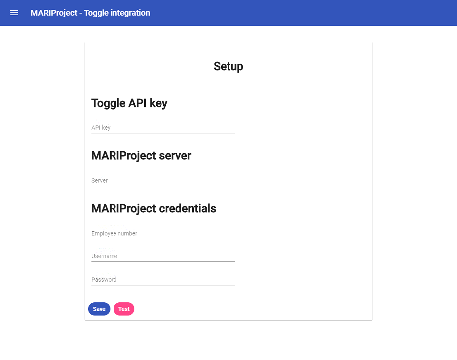
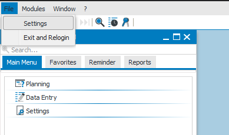
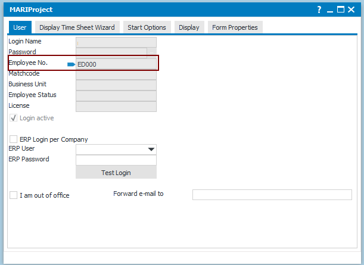
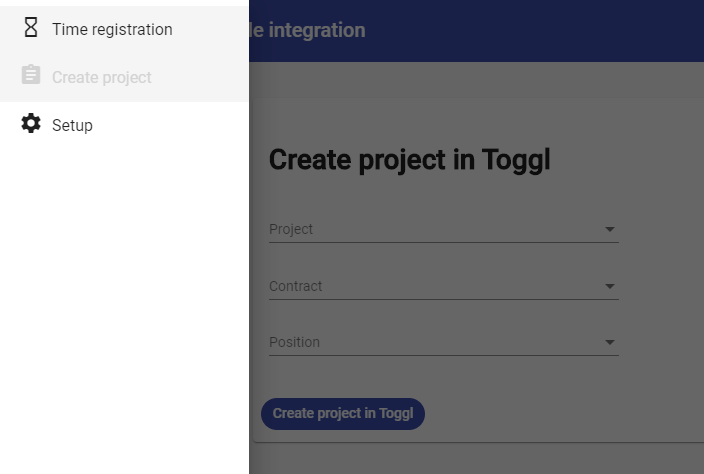
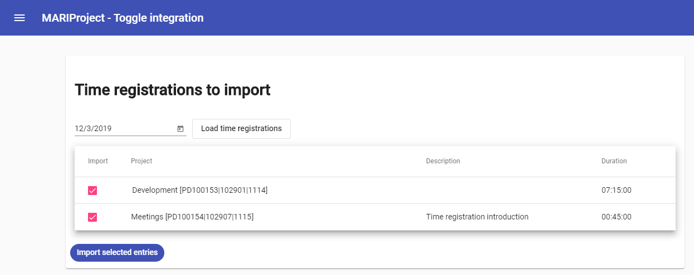

# MARIProject - Toggl integration
Small electron app that allows for integration between MARIProject  and Toggl.

## Features

 - Create Toggl projects based on MARIProject projects.
 - Use Toggl for Time tracking on projects and export your entries to MARIProject.

## Setup
You will need to provide a Toggl API key, MARIProject server and MARIProject credentials.

**Toggl API Key**

You get it from your Toggl profile: https://toggl.com/app/profile

**MARIProject server**

This is the full URL of the web-service provided by MARIProject.
It is normally something like: http://server/MARIProjectService/MARIWebService.asmx?WSDL
If you visit it in your browser it should show an XML page.

**MARIProject credentials**

Employee number - You can find this in the web client by going to File -> Settings.

Username - Username used for the web client

Password - Password used for the web client

## Creating projects
To start time registration in Toggl you first need to import projects from MARIProject.

This is done in the "Create project" page:

Select project, contract and position and press "Create project in Toggl". 

The project will now be created in Toggl and you can start time registration on it.

## Importing time entries
You can import your Toggl time entries from the "Time registration" page.

It will only show entries that are connected to a MARIProject project and have not been imported already.

Select what you want to import and press "Import selected entries".

## Errors
The error handling is very bare-bone and you will likely need to use the console to understand any errors.

The console can be opened using:  Ctrl + Shift + I
